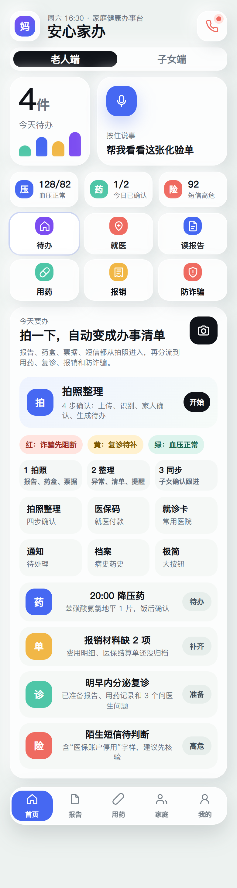

# SilverCare AI Family Assistant

银发家庭 AI 健康助手原型：安心家办。

## Why It Matters

很多家庭照护问题不是单点问诊，而是“资料散、提醒漏、老人不会操作、子女不知道下一步”。这个原型把报告拍照、用药提醒、复诊准备、报销材料、风险短信核验和子女通知中心放进一个面向银发家庭的 AI 办事台。

## Highlights

- 老人端与子女端双视角切换
- 拍报告、药盒、票据后生成可处理的家庭待办
- 用药确认、漏服提醒、复诊材料包和报销缺项提醒
- 子女通知中心，按风险等级推动下一步动作
- 合规边界明确：健康办事助手，不替代医生诊断

## Demo

Open `index.html` in a browser, or publish this repository with GitHub Pages.

## Project Team

This project was co-created by DanXian and Codex.

制作人员：

- DanXian: product direction, scenario design, and collaboration
- Codex: AI-assisted prototyping, frontend implementation, and README preparation

## Suggested Topics

`ai-healthcare`, `eldercare`, `family-care`, `health-assistant`, `prototype`, `github-pages`

