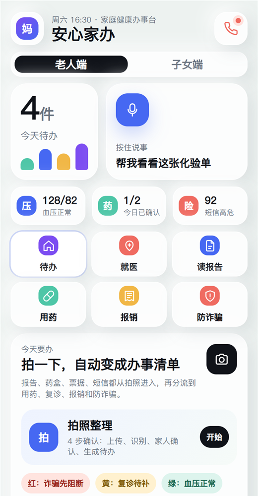
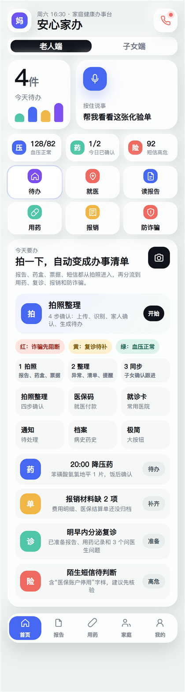

# SilverCare AI Family Assistant

An AI-powered family care prototype for eldercare tasks, medication reminders, follow-up preparation, insurance paperwork, and caregiver coordination.

[Live Demo](https://zhihaohu1996.github.io/silvercare-ai-family-assistant/) · [Repository](https://github.com/Zhihaohu1996/silvercare-ai-family-assistant)

  

## Overview

SilverCare AI Family Assistant is designed around a practical caregiving problem: families do not only need medical information, they need daily tasks to be captured, organized, confirmed, and followed through.

The prototype turns scattered reports, medicine boxes, receipts, appointment reminders, and risk messages into a simple family task flow. Older adults get a simplified interface with large actions, while adult children get a clearer view of risk levels, missing materials, and next steps.

## Key Features

- Dual elder and adult-child views for shared family care
- Camera-first flow for reports, medicine boxes, bills, and messages
- Medication confirmation with missed-dose escalation
- Follow-up visit preparation with missing-material checks
- Insurance and reimbursement document collection
- Caregiver notification center with risk-based prioritization
- Clear safety boundary: this is a care coordination assistant, not a diagnostic tool

## Screenshots

  

## Who It Is For

- Families caring for aging parents
- Eldercare service teams exploring AI-assisted workflows
- Clinics, pharmacies, or community service stations considering family follow-up tools
- Product builders studying practical AI workflows beyond chat-only interfaces

## Project Status

This is a high-fidelity static prototype. It is intended for product validation, user interviews, demos, and early workflow exploration.

## Roadmap Ideas

- Add a lightweight backend for household profiles and task history
- Add OCR-assisted document parsing with human confirmation
- Add caregiver permission controls and audit logs
- Add WeChat mini-program or mobile app packaging
- Add multilingual interface options for broader family use

## Team And Contributions

- Zhihao Hu: project owner, product vision, eldercare scenario research, user workflow definition, feature prioritization, market positioning, and final project direction
- DanXian: collaborator, scenario discussion, product feedback, and care-flow refinement
- Codex: AI-assisted implementation support, static frontend assembly, README formatting, and screenshot preparation

## License

MIT License. See [LICENSE](./LICENSE).
